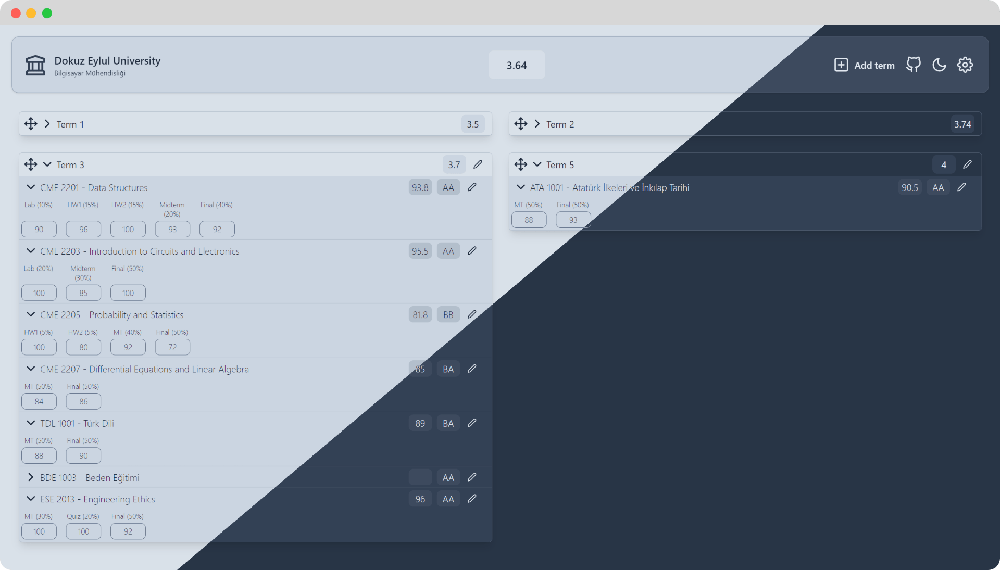
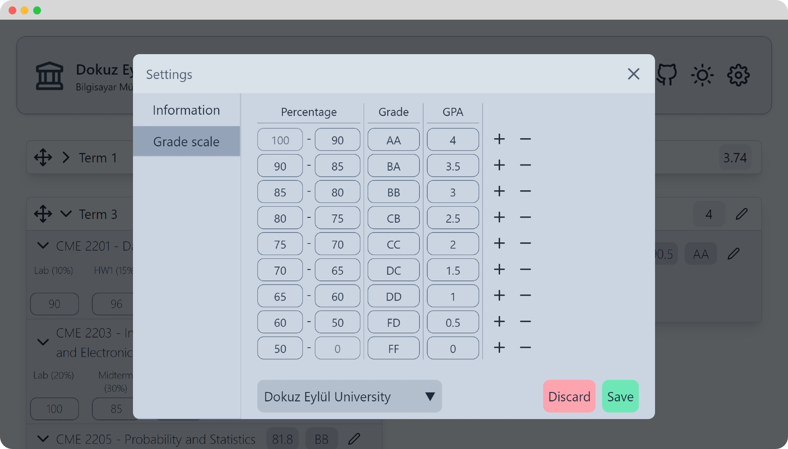

 

  

  <h3 align="center">Gradeful</h3>

  

    A grade tracker to monitor your progress throughout your university education.
     
    Note that this project is still WIP
     
     
    <a href="https://beyenilmez.github.io/gradeful/" target="_blank">View Demo</a>
  

## Screenshots

## Features

- Serverless auto GPA calculation
- Import/Export your grades from/to files
- Export/Share your grades with a URL
- Dark and light themes
- Customizable grade systems
- Grade system presets

  
View presets

  
    1. Bilkent University
    2. Bogazici University
    3. Dokuz Eylül University
    4. Ege University
    5. Hacettepe University
    6. Middle East Technical University
    7. Yeditepe University
    8. Yildiz Technical University

## Built With

- [React](https://react.dev/)
- [tailwindcss](https://tailwindcss.com/)
- [react-feather](https://github.com/feathericons/react-feather)
- [react-sortablejs](https://github.com/SortableJS/react-sortablejs)
- [base64-compressor](https://github.com/eliot-akira/base64-compressor)
- [tailwind-scrollbar](https://github.com/adoxography/tailwind-scrollbar)

## License

Distributed under the MIT License. See [LICENSE](https://github.com/beyenilmez/gradeful/blob/main/LICENSE) for more information.

